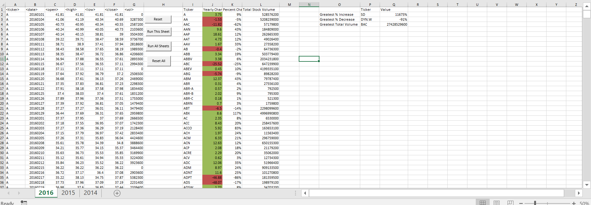
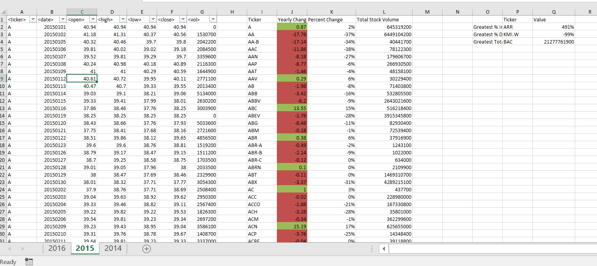
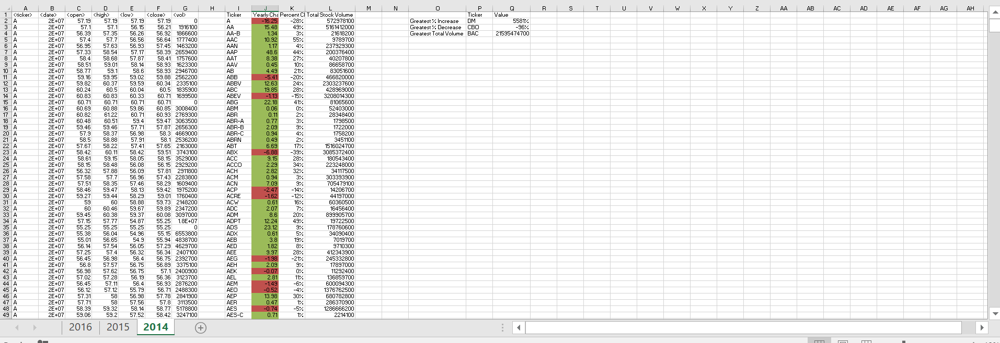

# Annual Stock Summary - 2014-2016

This project takes daily stock information and uses VBA to summarize annual statistics.

Tools: Excel VBA, Macros, Buttons, Conditional Formatting

The VBA code in these excels could be reused on other subsets of stock information in the future.

#### Summary Statistics

|        2016           | Ticker | Value          |
| --------------------- | -------| -------------- |
| Greatest % Increase   | SD     | 11,675%        |
| Greatest % Decrease   | DYN.W  | -91%           |
| Greatest Total Volume | BAC    | 27,428,529,600 |

|        2015           | Ticker | Value          |
| --------------------- | -------| -------------- |
| Greatest % Increase   | ARR    | 491%           |
| Greatest % Decrease   | KMI.W  | -99%           |
| Greatest Total Volume | BAC    | 21,277,761,900 |

|        2014           | Ticker | Value          |
| --------------------- | -------| -------------- |
| Greatest % Increase   | DM     | 5581%          |
| Greatest % Decrease   | BAC    | -96%           |
| Greatest Total Volume | BAC    | 21,595,474,700 |

##### 2016 Summary

##### 2015 Summary

##### 2014 Summary

